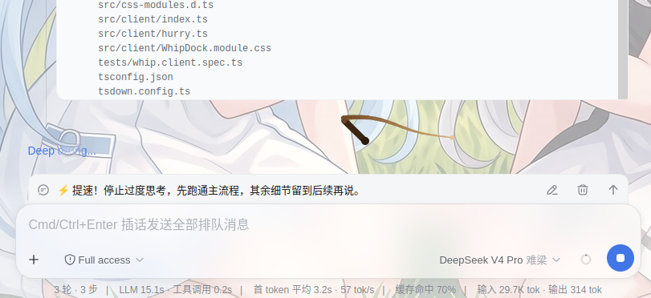

# dsh-plugin-ponytail

English | [中文](README.zh.md)

A whip easter egg for the [DeepSeek Harness](https://github.com/deepseek-ai/deepseek-harness) web GUI, inspired by the Claude Code "ponytail" whip. A small toggle in the composer dock arms a cursor-following rope whip; clicking the conversation transcript cracks it — a rigid-handle verlet whip with a gravity-drooped tail, a random whip-crack sound, and sparks — and sends a hurry-up message to the model.

## Screenshot



## Features
## Screenshot


## Features

- A `🪢 鞭子` pill in the `conversation.composer.dock` strip, under the composer card.
- While armed, the OS cursor is replaced by a whip that follows the pointer: a rigid handle fixed at 135° (up-left), a tapering body that softens toward the tip, and a tail that droops under gravity.
- Clicking the transcript cracks the whip and sends one of several hurry-up lines as an ordinary message.
- Crack audio plays a random MP3 from the plugin's own `public/` directory (`whip1..4.mp3`), served by the client plugin host — no dependency on the web app's own assets.

## Install

This is a **client bundle plugin** with a `dsh.bundle` declaration, so it installs with a single command. With a global `dsh`:

```sh
dsh plugin --profile web add github:makuralymi/dsh-plugin-ponytail
```

Without a global `dsh`:

```sh
npx @deepseek-ai/dsh plugin --profile web add github:makuralymi/dsh-plugin-ponytail
```

The command initializes the profile if needed, installs the package into the profile, auto-appends it to `dsh.profile.bundles` (because it declares `dsh.bundle`), and its `cordis.patch.yml` inserts the plugin row. Restart `dsh web` and refresh the page.

For local development, point the spec at a local path:

```sh
dsh plugin --profile web add link:/path/to/dsh-plugin-ponytail
```

## Usage

Restart the GUI and refresh the page. Click `🪢 鞭子` under the composer to arm the whip, then click anywhere in the conversation transcript to crack it. Press `Esc` or click the toggle again to disarm.

## Building from source

The plugin builds inside the DeepSeek Harness workspace (it relies on the shared tsdown client-bundle preset):

```sh
pnpm install
pnpm --filter dsh-client-ui-ponytail bundle
```

Prebuilt artifacts ship in `lib/`, so building is only needed when you edit `src/`.

## Project layout

- `src/client/` — browser half (dock entry, whip physics, crack audio, hurry lines).
- `src/index.ts` — node half (empty `apply`, pure UI plugin).
- `public/` — crack sound files (`whip1..4.mp3`), served at `/plugins/<id>/public/`.
- `cordis.patch.yml` — inserts the plugin row into the web profile.

## License

MIT
