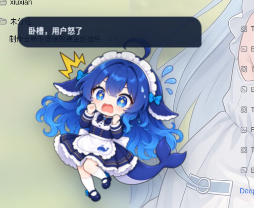

# dsh-plugin-ponytail

[English](README.md) | 中文

面向 [DeepSeek Harness](https://github.com/deepseek-ai/deepseek-harness) Web 界面的鞭子彩蛋插件，灵感来自 Claude Code 的 "ponytail" 小鞭子。在输入框底部的 composer dock 里放一个开关按钮，点击后鼠标变成一根跟随指针的鞭子；在对话输出区点击时，鞭子按物理效果抽动（带刚性杆子、重力下垂尾部的 verlet 物理 + 随机爆裂声 + 火花），并给模型发送一条催促加快工作的消息。

## 截图


## 功能

- 在 `conversation.composer.dock` 区域（composer 卡片下方）新增 `🪢 鞭子` 按钮。
- 开启后，系统光标被一根鞭子取代：手柄固定在 135°（左上方向），身体由根部的硬杆渐变到尾部的软鞭，尾部受重力下垂。
- 在对话区（而非输入框）点击，鞭子抽响，并通过输入机发送一条催促消息（多套文案轮换，不连续重复）。
- 爆裂声随机播放插件自身 `public/` 目录下的 MP3（`whip1..4.mp3`），由客户端插件宿主提供，不依赖 Web 应用自身资源。
- 每次抽鞭还会广播 `deepseek-pet:whip` 事件；DeepSeek Pet 插件监听后随机展示自身 `public/` 下的 `defense.png` / `frightened.png` / `giggle.png`，气泡分别显示「抱头蹲防！！！」/「卧槽，用户怒了」/「打不着，嘿嘿❤️」。随机选择与响应逻辑都在 deepseek-pet 插件内。

另外我们还有热血沸腾的组合技：[deepseek-pet大肥鱼桌宠](https://github.com/keleus/deepseek-pet.git),这样你就可以拿鞭子抽了。
## 截图



## 安装

这是带 `dsh.bundle` 声明的**客户端 bundle 插件**，一条命令即可安装。有全局 `dsh` 时：

```sh
dsh plugin --profile web add github:makuralymi/dsh-plugin-ponytail
```

没有全局 `dsh` 时：

```sh
npx @deepseek-ai/dsh plugin --profile web add github:makuralymi/dsh-plugin-ponytail
```

该命令会在需要时初始化 profile，将包安装进 profile，并因插件声明了 `dsh.bundle` 而自动把它加入 `dsh.profile.bundles`；插件的 `cordis.patch.yml` 会自动插入插件行。重启 `dsh web` 并刷新页面即可。

本地开发可将 spec 指向本地路径：

```sh
dsh plugin --profile web add link:/path/to/dsh-plugin-ponytail
```

## 使用

重启 GUI 并刷新页面。点击 composer 下方的 `🪢 鞭子` 打开鞭子模式，然后在对话区任意位置点击抽鞭。按 `Esc` 或再次点击开关即可关闭。

## 从源码构建

该插件在 DeepSeek Harness 工作区内构建（依赖共享的 tsdown 客户端 bundle 预设）：

```sh
pnpm install
pnpm --filter dsh-client-ui-ponytail bundle
```

仓库已随附 `lib/` 预构建产物，只有修改 `src/` 时才需要重新构建。

## 目录结构

- `src/client/` — 浏览器半区（dock 条目、鞭子物理、爆裂声、催促文案）。
- `src/index.ts` — Node 半区（空 `apply`，纯 UI 插件）。
- `public/` — 爆裂声文件（`whip1..4.mp3`），由 `/plugins/<id>/public/` 提供。
- `cordis.patch.yml` — 将插件行插入 web profile。

## 许可证

MIT
